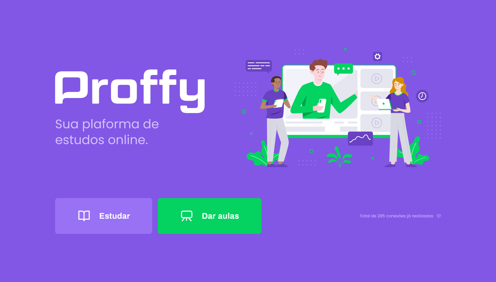
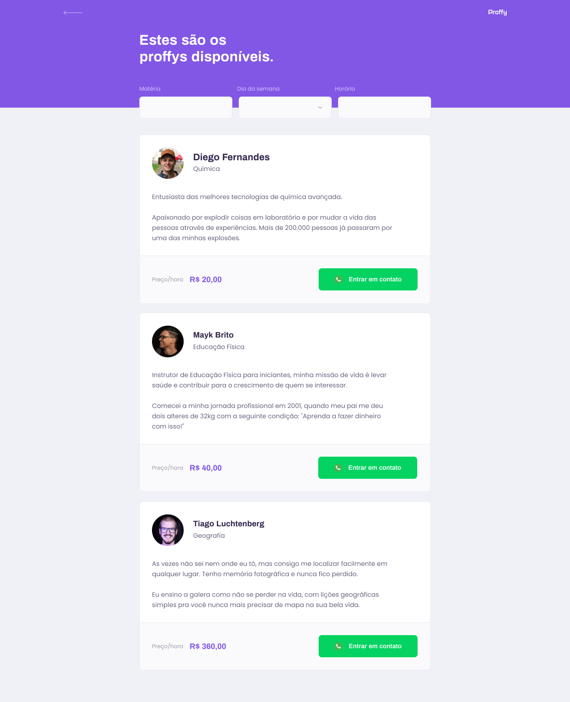
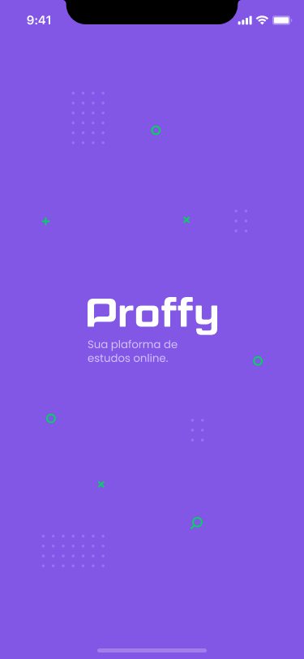
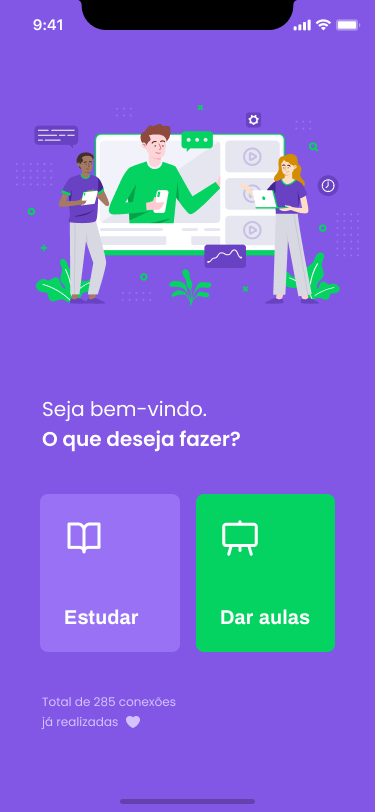
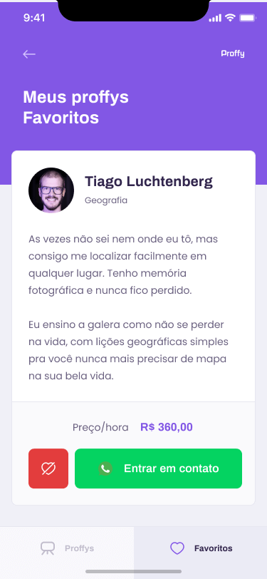

# Proffy

## 🏁 Objetivo 🏁 

### Proffy es una plataforma que desea conectar docentes con los alumnos impartiendo ramos de su interez a la hora que desees. Esta plataforma tecnológica está compuesto por una aplicación móvil y una plataforma web. En la plataforma web puedes registrarte como docente y seleccionar las áreas que deseas impartir clases como también los horarios que deseas impartirlos, otras acción que puedes realizar es de listar los profesores. Ya la aplicación móvil en la versión 1.0 de proffy está focada en el alumno donde el podrá listar los profesores que imparten las clases de su interez al horario que el profe registro como disponible; esta interacción culmina con un telefono de contacto y el email para ponerse de acuerdo con el docente.

## 📸 Preview Versión 1.0 📸

## 👷 Para la cración de la plataforma tecnológica se utilizó 👷

### 🔧 Node.js
### 🔧 React
### 🔧 Typescript
### 🔧 Knex
### 🔧 SQLite
### 🔧 React-Native
### 🔧 Expo

## 🕺 Clona este repositorio 🕺

### 🗄️ Server: Paso 1: Después de clonar el repositorio, extraerlo y abrir la pasta server en VSCode debes hacer npm install (o yarn install) para instalar las dependencias que están en package.json. Luego debes ejecutar las migrations de la base de datos con el comando npm run knex:migrate donde se realizará las migrations. Al terminar esa configuración para hacer funcionar la api que esta en localhost:3000 es con el comando npm start (o yarn start) y todo listo por aqui. 👌

### 🖥 Web: Paso 2: Debes abrir la pasta web en VSCode y hacer npm install (o yarn install) para instalar las dependencias que están en package.json. Luego ejecutas npm start (o yarn start) en la terminal integrada de VSCode y eso debería abrir una página en tu browser con la dirección localhost:3000. Con esta configuración está listo! 👌

### 📱 Mobile: Paso 3: Debes abrir la pasta mobile en VSCode y hacer npm install (o yarn install) para instalar las dependencias que están en package.json. Luego ejecutas npm start (o yarn start) en la terminal integrada de VSCode y eso debería abrir una página en tu browser de expo. Con esta configuración está listo! Ahora solo debes bajar expo en tu smartphone para abrir la aplicación por el qrcode o seleccionar el emulador para abrir la app 👌